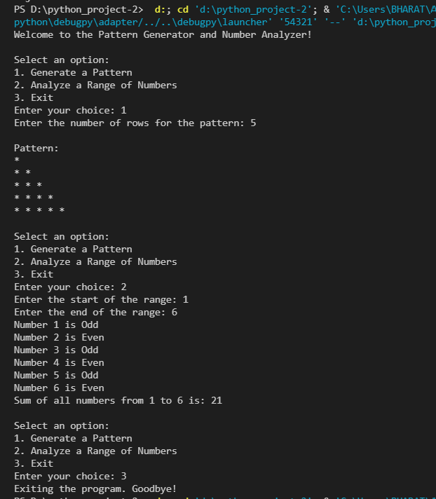

# Pattern Generator and Number Analyzer

A simple Python project that allows users to:

- Generate a star (`*`) pattern
- Analyze numbers in a given range
- Check whether numbers are Even or Odd
- Calculate the sum of numbers
- Exit the program using a menu-driven system

---

## 📌 Features

✨ Generate Triangle Star Patterns  
✨ Analyze Numbers in a Range  
✨ Check Even and Odd Numbers  
✨ Calculate Total Sum  
✨ User-Friendly Menu System  

---

## 🛠️ Technologies Used

- Python
- Loops (`for`, `while`)
- Conditional Statements (`if`, `elif`, `else`)
- Nested Loops

---

## 📂 Project Code

```python
print("Welcome to the Pattern Generator and Number Analyzer!")

while True:
    print("\nSelect an option:")
    print("1. Generate a Pattern")
    print("2. Analyze a Range of Numbers")
    print("3. Exit")

    choice = int(input("Enter your choice: "))

    if choice == 1:
        rows = int(input("Enter the number of rows for the pattern: "))

        if rows <= 0:
            print(" enter the positive number.")
        else:
            print("\nPattern:")

            for i in range(1, rows + 1):
                for j in range(i):
                    print("*", end=" ")
                print()

    elif choice == 2:
        start = int(input("Enter the start of the range: "))
        end = int(input("Enter the end of the range: "))

        if end < start:
            print("End number must be greater than start number.")
        else:
            total = 0

            for i in range(start, end + 1):

                if i % 2 == 0:
                    print("Number", i, "is Even")
                else:
                    print("Number", i, "is Odd")

                total = total + i

            print("Sum of all numbers from", start, "to", end, "is:", total)

    elif choice == 3:
        print("Exiting the program. Goodbye!")
        break
```

---

# 📸 Output Screenshot



---

# ▶️ How to Run

1. Install Python  
2. Save the file as `main.py`
3. Open terminal or VS Code
4. Run the command:

```bash
python main.py
```

---

# 👩‍💻 Author

Priya Shihora

---

# ⭐ Project Description

This project is created for learning Python basics like loops, conditions, nested loops, and menu-driven programming in a simple and interactive way.
