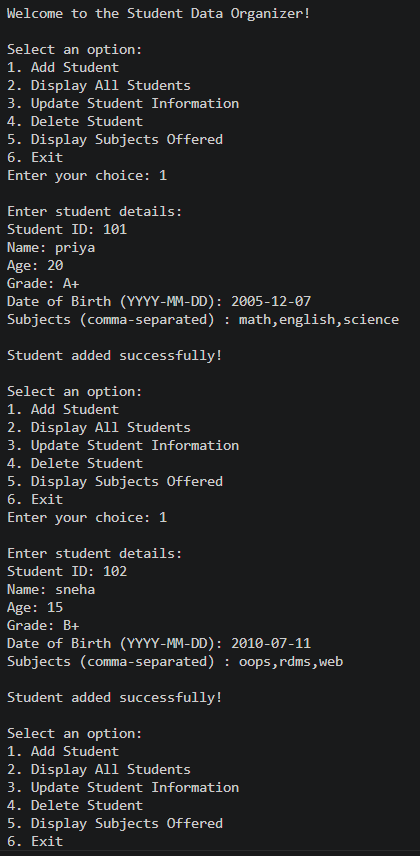
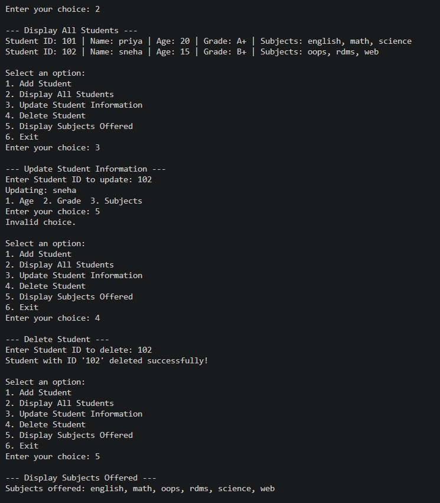
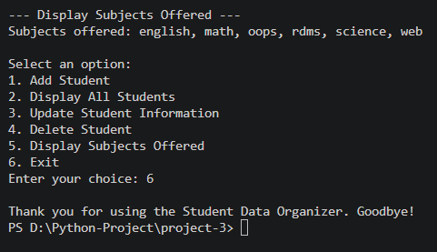

<div align="center">


<br/>


<br/>

```
 ____  _             _            _     ____        _
/ ___|| |_ _   _  __| | ___ _ __ | |_  |  _ \  __ _| |_ __ _
\___ \| __| | | |/ _` |/ _ \ '_ \| __| | | | |/ _` | __/ _` |
 ___) | |_| |_| | (_| |  __/ | | | |_  | |_| | (_| | || (_| |
|____/ \__|\__,_|\__,_|\___|_| |_|\__| |____/ \__,_|\__\__,_|

        O r g a n i z e r  —  P y t h o n  C L I  A p p
```

</div>

---

## 💡 What is this?

A **console-based Student Management System** built in Python that puts all four core data structures to real use. No fancy libraries. No database. Just pure Python doing exactly what it was designed for.

You can **add** students, **view** records, **update** details, and **delete** entries — all from a clean interactive menu that loops until you're done.

---

## 🗂️ Folder Structure

```
📦 python_project/
└── 📁 project-3/
    ├── 🐍 project-3.py       ← The entire app lives here
    ├── 🖼️ output-1.png        ← Add & Display demo
    ├── 🖼️ output-2.png        ← Update & Delete demo
    ├── 🖼️ output-3.png        ← Subjects & Exit demo
    └── 📄 README.md           ← You are here
```

---

## 🧠 Data Structures — The Real Stars

> This project isn't just about students. It's about *why* we pick each data structure.

```
┌─────────────┬────────────────────────────────────────────────────┐
│  Structure  │  Why it's used here                                │
├─────────────┼────────────────────────────────────────────────────┤
│  📋 List    │  Stores ALL students — ordered, iterable, mutable  │
│  📖 Dict    │  One student's details — name, age, grade, etc.    │
│  🔵 Set     │  Subjects — automatically removes duplicates       │
│  🔒 Tuple   │  (student_id, dob) — paired & protected forever    │
└─────────────┴────────────────────────────────────────────────────┘
```

Together they form one clean record:

```python
student = {
    "student_id" : "S101",
    "name"       : "Priya Shihora",
    "age"        : 20,
    "grade"      : "A",
    "subjects"   : {"Math", "Physics", "English"},   # ← SET
    "id_dob"     : ("S101", "2004-06-15")            # ← TUPLE
}

students.append(student)        # students = LIST of DICTS
all_subjects.update(subjects)   # global SET of all subjects
```

---

## ⚙️ Menu Options

```
╔══════════════════════════════════════╗
║      STUDENT DATA ORGANIZER          ║
╠══════════════════════════════════════╣
║  1 ──► Add Student                   ║
║  2 ──► Display All Students          ║
║  3 ──► Update Student Information    ║
║  4 ──► Delete Student                ║
║  5 ──► Display Subjects Offered      ║
║  6 ──► Exit                          ║
╚══════════════════════════════════════╝
```

---

## 🔄 Program Flow

```
                        ┌─────────────────┐
                        │  Program Start  │
                        └────────┬────────┘
                                 │
                                 ▼
                      ┌──────────────────────┐
                      │   Display Main Menu  │◄──────────────┐
                      └──────────┬───────────┘               │
                                 │                           │
          ┌──────────┬───────────┼───────────┬──────────┐    │
          ▼          ▼           ▼           ▼          ▼    │
       ┌──────┐  ┌────────┐ ┌────────┐ ┌────────┐ ┌──────┐  │
       │  1   │  │   2    │ │   3    │ │   4    │ │  5   │  │
       │ Add  │  │Display │ │Update  │ │Delete  │ │ Show │  │
       │Stud. │  │  All   │ │Student │ │Student │ │Subj. │  │
       └──┬───┘  └───┬────┘ └───┬────┘ └───┬────┘ └──┬───┘  │
          │          │          │           │         │      │
          ▼          ▼          ▼           ▼         ▼      │
       ┌──────────────────────────────────────────────────┐  │
       │              Print Output to Console             │  │
       └──────────────────────┬───────────────────────────┘  │
                              │                              │
                              └──────────────────────────────┘
                                     Loop continues...
                                            │
                                       (Choice: 6)
                                            │
                                            ▼
                                    ┌───────────────┐
                                    │  Exit & Quit  │ ✅
                                    └───────────────┘
```

---

## 🔍 How Each Feature Works

### ➕ Add Student
Collects name, age, grade, date of birth, and subjects. Packs everything into a dictionary and appends it to the master list. Subjects are stored as a `set` — so duplicates never survive.

---

### 📋 Display All Students
Loops through the list, pulls data from each dictionary, and prints a clean one-line summary per student. Subjects are sorted before display for readability.

---

### ✏️ Update Student
Searches by Student ID. Once found, uses a **nested `match` statement** to let the user pick exactly what to change — age, grade, or subjects — without touching anything else.

---

### 🗑️ Delete Student
Finds the student by ID using index-based iteration and uses `del` to remove them cleanly from the list. Confirms deletion or reports if not found.

---

### 📚 Display Subjects Offered
Pulls from `all_subjects` — the global `set` that grows every time a student is added or updated. Since it's a `set`, every subject appears exactly once, sorted alphabetically.

---

## 📸 Output Screenshots

### Add & Display Students


### Update & Delete Student


### Subjects Offered & Exit


---

## 🔬 Key Python Concepts Used

| Concept | Where |
|--------|-------|
| `while True` loop | Main menu runs forever until Exit |
| `match-case` | Menu & update option handling (Python 3.10+) |
| `dict` operations | `found["age"] = ...` for in-place updates |
| `set.update()` | Merging new subjects into global set |
| `del list[i]` | Index-based deletion from list |
| f-strings | All formatted console output |
| Set comprehension | `set(s.strip() for s in input.split(","))` |

---

## 🚀 How to Run

```bash
# Make sure Python 3.10+ is installed
python --version

# Navigate to the project folder
cd python_project/project-3

# Run the app
python project-3.py
```

---

## 🌱 What Can Be Added Next

- 💾 Save records to a `.json` or `.csv` file so data persists after exit
- 🔍 Search student by name or grade
- 📊 Display grade-wise statistics
- 🔐 Add login system for admin access
- 🖥️ Build a GUI version using `tkinter`

---

## 📄 License

```
MIT License — Free to use, modify, and distribute with attribution.
```

---

## 👤 Author

<div align="center">

### Priya Shihora

[](https://github.com/isamaliya16)
[](https://www.linkedin.com/in/ayush-isamaliya-686533312/)

**Junior Python Developer · India**

> *"The best way to learn data structures is to build something real with them."*

</div>

---

<div align="center">
Made with ❤️ and Python 🐍 · Last updated: 28 May, 2026

</div>
