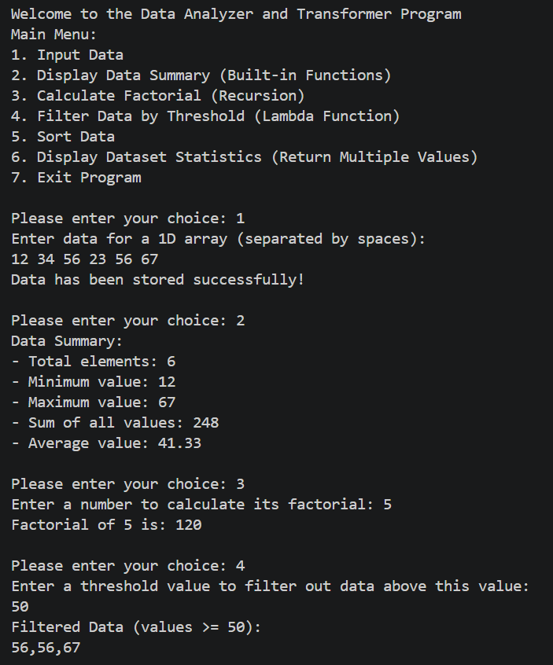
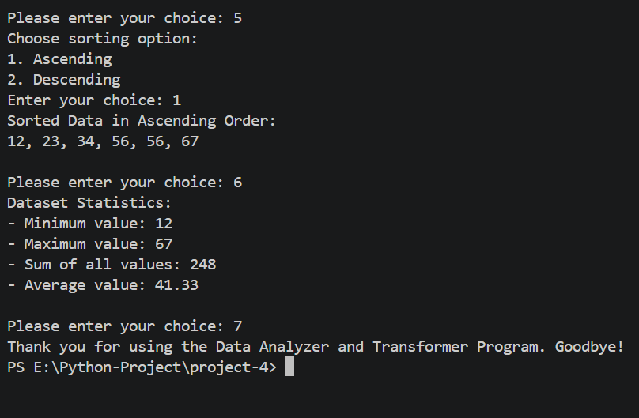

<div align="center">


<br/>


<br/>

```
  ____        _          _                _
 |  _ \  __ _| |_ __ _  / \   _ __   __ _| |_   _ _______ _ __
 | | | |/ _` | __/ _` |/ _ \ | '_ \ / _` | | | | |_  / _ \ '__|
 | |_| | (_| | || (_| / ___ \| | | | (_| | | |_| |/ /  __/ |
 |____/ \__,_|\__\__,_/_/   \_\_| |_|\__,_|_|\__, /___\___|_|
                                               |___/
        T r a n s f o r m e r  —  P y t h o n  C L I  A p p
```

</div>

---

## 💡 What is this?

A **console-based Data Analyzer and Transformer** built in Python that demonstrates core programming concepts in action. No external libraries. No database. Just pure Python functions working together.

You can **input** a 1D array, **summarize** it, **calculate factorial** recursively, **filter** values using lambdas, **sort** in any order, and **view statistics** — all from a clean interactive menu.

---

## 🗂️ Folder Structure

```
📦 python_project/
└── 📁 project-2/
    ├── 🐍 pro-4.py       ← The entire app lives here
    ├── 🖼️ output-1.png        ← Input, Summary & Factorial demo
    ├── 🖼️ output-2.png        ← Filter, Sort & Statistics demo
    └── 📄 README.md           ← You are here
```

---

## 🧠 Key Python Concepts — The Real Stars

> This project isn't just about data. It's about *why* we use each programming technique.

```
┌──────────────────────┬────────────────────────────────────────────────────┐
│  Concept             │  Why it's used here                                │
├──────────────────────┼────────────────────────────────────────────────────┤
│  🌍 Global Variables │  dataset & global_summary shared across functions  │
│  🔁 Recursion        │  factorial(n) calls itself until base case         │
│  ⚡ Lambda Function  │  filter(lambda x: x >= threshold, dataset)         │
│  📦 Built-in Funcs   │  min(), max(), sum(), len() for quick stats        │
│  🔄 Multiple Return  │  statistics() returns 4 values at once             │
│  🔀 Sorting          │  .sort() and .sort(reverse=True) on copied list    │
└──────────────────────┴────────────────────────────────────────────────────┘
```

Together they form one clean program:

```python
# Global state shared across all functions
dataset = []
global_summary = {}

# Recursion — function calls itself
def factorial(n):
    if n == 0 or n == 1:
        return 1
    return n * factorial(n - 1)      # ← RECURSIVE CALL

# Lambda — anonymous function on the fly
result = list(filter(lambda x: x >= threshold, dataset))   # ← LAMBDA

# Multiple return values — pack and unpack
def statistics():
    return min(dataset), max(dataset), sum(dataset), sum(dataset)/len(dataset)

a, b, c, d = statistics()            # ← MULTIPLE RETURN VALUES
```

---

## ⚙️ Menu Options

```
╔══════════════════════════════════════════════════════╗
║         DATA ANALYZER AND TRANSFORMER                ║
╠══════════════════════════════════════════════════════╣
║  1 ──► Input Data                                    ║
║  2 ──► Display Data Summary (Built-in Functions)     ║
║  3 ──► Calculate Factorial (Recursion)               ║
║  4 ──► Filter Data by Threshold (Lambda Function)    ║
║  5 ──► Sort Data                                     ║
║  6 ──► Display Dataset Statistics (Multiple Return)  ║
║  7 ──► Exit Program                                  ║
╚══════════════════════════════════════════════════════╝
```

---

## 🔄 Program Flow

```
                        ┌─────────────────┐
                        │  Program Start  │
                        └────────┬────────┘
                                 │
                                 ▼
                      ┌──────────────────────┐
                      │   Display Main Menu  │◄──────────────┐
                      └──────────┬───────────┘               │
                                 │                           │
       ┌──────────┬──────────────┼──────────┬──────────┐     │
       ▼          ▼              ▼          ▼          ▼     │
   ┌───────┐ ┌─────────┐  ┌──────────┐ ┌────────┐ ┌──────┐  │
   │   1   │ │    2    │  │    3     │ │   4    │ │  5   │  │
   │ Input │ │Summary  │  │Factorial │ │ Filter │ │ Sort │  │
   │  Data │ │(Builtin)│  │(Recurse) │ │(Lambda)│ │ Data │  │
   └───┬───┘ └────┬────┘  └────┬─────┘ └───┬────┘ └──┬───┘  │
       │          │            │            │         │      │
       ▼          ▼            ▼            ▼         ▼      │
   ┌──────────────────────────────────────────────────────┐  │
   │              Print Output to Console                 │  │
   └──────────────────────┬───────────────────────────────┘  │
                          │                                  │
                          └──────────────────────────────────┘
                                   Loop continues...
                                          │
                                     (Choice: 7)
                                          │
                                          ▼
                                  ┌───────────────┐
                                  │  Exit & Quit  │ ✅
                                  └───────────────┘
```

---

## 🔍 How Each Feature Works

### 📥 Input Data
Takes space-separated integers from the user and stores them in the global `dataset` list using `map(int, ...)`. All other features depend on this being filled first.

---

### 📊 Display Data Summary
Uses Python's built-in `min()`, `max()`, `sum()`, and `len()` to compute stats instantly. Also stores `total` and `mean` into the global `global_summary` dictionary for potential reuse.

---

### 🔁 Calculate Factorial
A classic **recursive function** — `factorial(n)` keeps calling itself with `n-1` until it hits the base case (`n == 0` or `n == 1`). No loops needed.

---

### ⚡ Filter Data by Threshold
Uses a **lambda function** inside Python's built-in `filter()` to keep only values **≥ threshold**. One line of logic, zero named functions.

---

### 🔀 Sort Data
Copies the dataset first (`.copy()`) to avoid mutating the original, then uses **`match-case`** to sort ascending or descending based on user's choice.

---

### 📈 Display Dataset Statistics
Calls `statistics()` which **returns four values at once** — min, max, sum, average — unpacked in a single line: `a, b, c, d = statistics()`.

---

## 📸 Output Screenshots

### Input, Summary, Factorial & Filter


### Sort, Statistics & Exit


---

## 🔬 Key Python Concepts Used

| Concept | Where |
|--------|-------|
| `global` keyword | `dataset` & `global_summary` shared across functions |
| Recursion | `factorial(n)` calls `factorial(n-1)` |
| `lambda` | `filter(lambda x: x >= threshold, dataset)` |
| Built-in functions | `min()`, `max()`, `sum()`, `len()` |
| Multiple return values | `return a, b, c, d` then `a, b, c, d = statistics()` |
| `match-case` | Menu navigation & sort direction (Python 3.10+) |
| `.copy()` | Prevents original dataset mutation during sort |
| f-strings | All formatted console output |

---

## 🚀 How to Run

```bash
# Make sure Python 3.10+ is installed
python --version

# Navigate to the project folder
cd python_project/project-2

# Run the app
python pro-4.py
```

---

## 🌱 What Can Be Added Next

- 💾 Save dataset to a `.csv` or `.txt` file for persistence
- 📉 Add median and mode calculations
- 📊 Plot a histogram using `matplotlib`
- 🔍 Search for a specific value in the dataset
- 🔢 Support for float inputs, not just integers

---

## 📄 License

```
MIT License — Free to use, modify, and distribute with attribution.
```

---

## 👤 Author

<div align="center">

### Priya Shihora

**Junior Python Developer · India**

> *"Understanding functions deeply is the foundation of writing clean, reusable code."*

</div>

---

<div align="center">
Made with ❤️ and Python 🐍 · Last updated: June 2026

</div>
