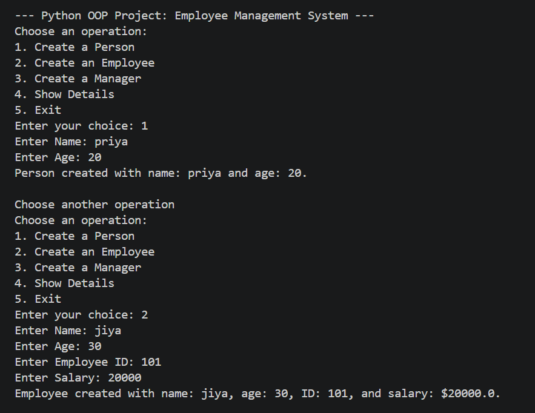
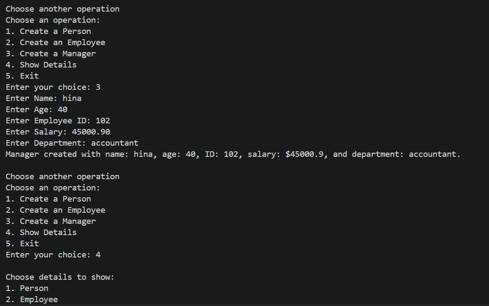
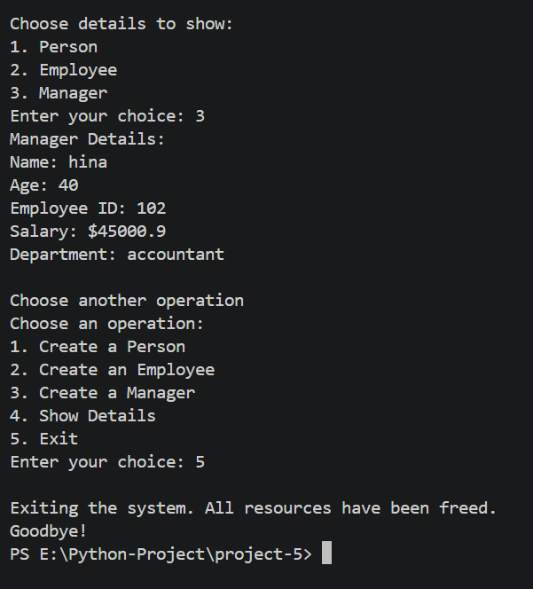

<div align="center">


<br/>


<br/>

```
  _____                 _                       
 | ____|_ __ ___  _ __ | | ___  _   _  ___  ___ 
 |  _| | '_ ` _ \| '_ \| |/ _ \| | | |/ _ \/ _ \
 | |___| | | | | | |_) | | (_) | |_| |  __/  __/
 |_____|_| |_| |_| .__/|_|\___/ \__, |\___|\___|
                 |_|             |___/           
  __  __                                                   _   
 |  \/  | __ _ _ __   __ _  __ _  ___ _ __ ___   ___ _ __ | |_ 
 | |\/| |/ _` | '_ \ / _` |/ _` |/ _ \ '_ ` _ \ / _ \ '_ \| __|
 | |  | | (_| | | | | (_| | (_| |  __/ | | | | |  __/ | | | |_ 
 |_|  |_|\__,_|_| |_|\__,_|\__, |\___|_| |_| |_|\___|_| |_|\__|
                             |___/                               
        S y s t e m  —  P y t h o n  O O P  C L I  A p p
```

</div>

---

## 💡 What is this?

A **console-based Employee Management System** built in Python that demonstrates core Object-Oriented Programming concepts in action. No external libraries. No database. Just pure Python classes working together.

You can **create** a Person, Employee, or Manager, and **view their details** — all from a clean interactive menu. The project showcases how real-world entities map to Python classes using inheritance, encapsulation, and method overriding.

---

## 🗂️ Folder Structure

```
📦 Python-Project/
└── 📁 project-5/
    ├── 🐍 project-5.py       ← The entire app lives here
    ├── 🖼️ output-1.png        ← Person & Employee creation demo
    ├── 🖼️ output-2.png        ← Manager creation & Show Details demo
    ├── 🖼️ output-3.png        ← Show Manager Details & Exit demo
    └── 📄 README.md           ← You are here
```

---

## 🧠 Key Python Concepts — The Real Stars

> This project isn't just about managing employees. It's about *why* we use each OOP technique.

```
┌──────────────────────┬────────────────────────────────────────────────────┐
│  Concept             │  Why it's used here                                │
├──────────────────────┼────────────────────────────────────────────────────┤
│  🏗️ Classes          │  Person, Employee, Manager, Developer as blueprints│
│  🔗 Inheritance      │  Employee extends Person, Manager extends Employee  │
│  🔒 Encapsulation    │  __employee_id & __salary are private attributes   │
│  🔄 Polymorphism     │  display() behaves differently in each class       │
│  🧹 Destructor       │  __del__() defined in Person for cleanup           │
│  🔑 Getter/Setter    │  get/set methods for private attributes            │
└──────────────────────┴────────────────────────────────────────────────────┘
```

Together they form one clean program:

```python
# Inheritance — Employee inherits from Person
class Employee(Person):
    def __init__(self, name, age, employee_id, salary):
        super().__init__(name, age)          # ← CALLING PARENT CONSTRUCTOR

# Encapsulation — private attributes with name mangling
self.__employee_id = employee_id             # ← PRIVATE ATTRIBUTE
self.__salary = salary

# Getter & Setter — controlled access to private data
def get_salary(self):
    return self.__salary                     # ← GETTER

def set_salary(self, salary):
    self.__salary = salary                   # ← SETTER

# Polymorphism — display() overridden in each subclass
def display(self):                           # ← OVERRIDDEN METHOD
    print("Manager Details:")
    print("Department:", self.department)
```

---

## ⚙️ Menu Options

```
╔══════════════════════════════════════════════════════╗
║      PYTHON OOP PROJECT: EMPLOYEE MANAGEMENT         ║
╠══════════════════════════════════════════════════════╣
║  1 ──► Create a Person                               ║
║  2 ──► Create an Employee                            ║
║  3 ──► Create a Manager                              ║
║  4 ──► Show Details                                  ║
║  5 ──► Exit                                          ║
╚══════════════════════════════════════════════════════╝
```

---

## 🔄 Program Flow

```
                        ┌─────────────────┐
                        │  Program Start  │
                        └────────┬────────┘
                                 │
                                 ▼
                      ┌──────────────────────┐
                      │   Display Main Menu  │◄──────────────┐
                      └──────────┬───────────┘               │
                                 │                           │
          ┌──────────┬───────────┼──────────┐                │
          ▼          ▼           ▼          ▼                │
      ┌────────┐ ┌────────┐ ┌─────────┐ ┌────────┐          │
      │   1    │ │   2    │ │    3    │ │   4    │          │
      │ Create │ │ Create │ │ Create  │ │  Show  │          │
      │ Person │ │  Emp.  │ │ Manager │ │Details │          │
      └───┬────┘ └───┬────┘ └────┬────┘ └───┬────┘          │
          │          │           │          │               │
          ▼          ▼           ▼          ▼               │
      ┌──────────────────────────────────────────────────┐  │
      │              Print Output to Console             │  │
      └──────────────────────┬───────────────────────────┘  │
                             │                              │
                             └──────────────────────────────┘
                                    Loop continues...
                                           │
                                      (Choice: 5)
                                           │
                                           ▼
                                   ┌───────────────┐
                                   │  Exit & Quit  │ ✅
                                   └───────────────┘
```

---

## 🔍 How Each Feature Works

### 👤 Create a Person
Takes `name` and `age` as input and creates a `Person` object. This is the **base class** — all other classes inherit from it. Also defines a `__del__` destructor for resource cleanup.

---

### 🧑‍💼 Create an Employee
Extends `Person` with `employee_id` and `salary`. These are stored as **private attributes** (`__employee_id`, `__salary`) and accessed only through getter/setter methods — demonstrating **encapsulation**.

---

### 👨‍💼 Create a Manager
Extends `Employee` with an additional `department` field. Uses `super()` to chain constructors up the inheritance tree. The `display()` method is **overridden** to show manager-specific details — demonstrating **polymorphism**.

---

### 📋 Show Details
Lets the user choose which object's details to display (Person, Employee, or Manager). Each calls its own version of `display()` — the same method name, different behavior based on the object type.

---

## 📸 Output Screenshots

### Person & Employee Creation


### Manager Creation & Show Details Menu


### Show Manager Details & Exit


---

## 🔬 Key Python Concepts Used

| Concept | Where |
|--------|-------|
| `class` & `__init__` | All three classes: `Person`, `Employee`, `Manager` |
| Inheritance | `Employee(Person)`, `Manager(Employee)` |
| `super()` | Chaining constructors across the hierarchy |
| Encapsulation | `__employee_id`, `__salary` as private attributes |
| Getter / Setter | `get_salary()`, `set_salary()`, `get_employee_id()`, `set_employee_id()` |
| Polymorphism | `display()` overridden in each subclass |
| Destructor | `__del__()` defined in `Person` |
| `match-case` | Menu navigation (Python 3.10+) |
| f-strings | All formatted console output |

---

## 🚀 How to Run

```bash
# Make sure Python 3.10+ is installed
python --version

# Navigate to the project folder
cd Python-Project/project-5

# Run the app
python project-5.py
```

---

## 🌱 What Can Be Added Next

- 💾 Save employee records to a `.csv` or `.json` file for persistence
- 🔍 Search/filter employees by name, ID, or department
- ✏️ Update existing employee records dynamically
- 🗑️ Delete employee records from the system
- 👩‍💻 Add a `Developer` class with `programming_language` attribute
- 📊 Display all records in a formatted table view

---

## 📄 License

```
MIT License — Free to use, modify, and distribute with attribution.
```

---

## 👤 Author

<div align="center">

### Priya Shihora

**Junior Python Developer · India**

> *"OOP is not just a technique — it's a way of thinking about the real world in code."*

</div>

---

<div align="center">
Made with ❤️ and Python 🐍 · Last updated: June 2026

</div>
