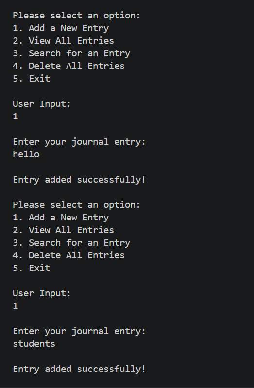
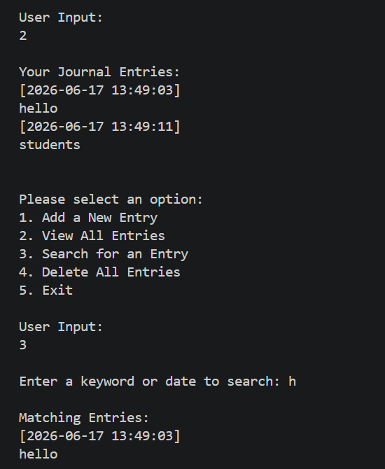
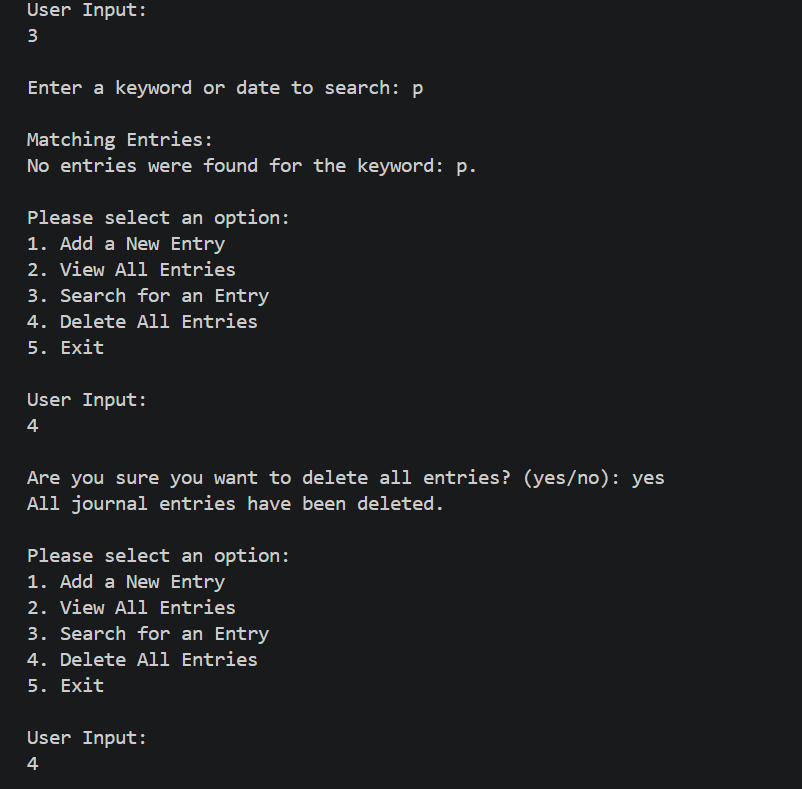
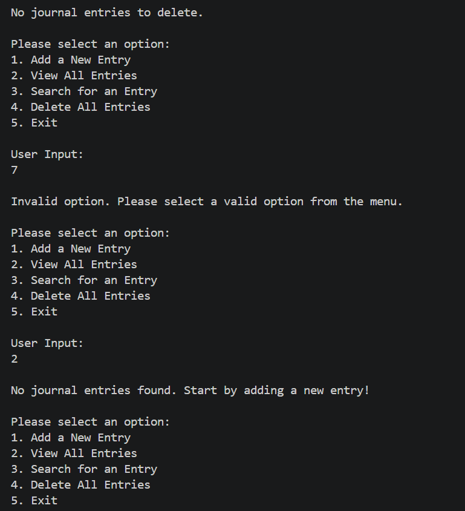
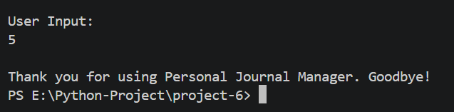

<div align="center">


<br/>


<br/>

```
    ___                              _   _____                             _
   / _ \  ___  _ __  ___  ___  _ __   / \  | |   | |  _ __ ___   __ _  _ __   __ _  __ _  ___ _ __
  / /_)/ / _ \| '__|/ __|/ _ \| '_ \ / _ \ | |   | | | '_ ` _ \ / _` || '_ \ / _` |/ _` |/ _ \ '__|
 / ___/ |  __/| |   \__ \  __/| | | / ___ \| |___| |_| | | | | | (_| || | | | (_| | (_| |  __/ |
 \/      \___||_|   |___/\___||_| |_/_/   \_\_____|_____|_| |_| |_|\__,_||_| |_|\__,_|\__, |\___|_|
                                                                                       |___/
              J o u r n a l  M a n a g e r  —  P y t h o n  C L I  A p p
```

</div>

---

## 💡 What is this?

A **console-based Personal Journal Manager** built in Python using Object-Oriented Programming and File Handling. No fancy libraries. No database. Just pure Python writing your thoughts to a `.txt` file and reading them back whenever you need.

You can **add** journal entries, **view** all entries, **search** by keyword or date, and **delete** all entries — all from a clean interactive menu that loops until you're done.

---

## 🗂️ Folder Structure

```
📦 python_project/
└── 📁 project-6/
    ├── 🐍 project-6.py       ← The entire app lives here
    ├── 📝 journal.txt         ← Auto-created to store entries
    ├── 🖼️ output-1.png        ← Add Entry demo
    ├── 🖼️ output-2.png        ← View Entries demo
    ├── 🖼️ output-3.png        ← Search Entry demo
    ├── 🖼️ output-4.png        ← Delete Entries demo
    ├── 🖼️ output-5.png        ← Exit & Invalid Option demo
    └── 📄 README.md           ← You are here
```

---

## 🧠 Core Concepts — The Real Stars

> This project isn't just about journaling. It's about *how* Python handles files and classes together.

```
┌──────────────────┬────────────────────────────────────────────────────┐
│  Concept         │  Why it's used here                                │
├──────────────────┼────────────────────────────────────────────────────┤
│  📦 Class (OOP)  │  JournalManager wraps all logic cleanly            │
│  📂 File I/O     │  Reads & writes entries to journal.txt             │
│  🕐 datetime     │  Auto-timestamps every entry on save               │
│  🔀 match-case   │  Menu navigation (Python 3.10+)                    │
└──────────────────┴────────────────────────────────────────────────────┘
```

Each entry is stored in `journal.txt` like this:

```python
class JournalManager:
    def __init__(self):
        self.filename = "journal.txt"   # ← File where all entries live

    def add_entry(self):
        timestamp = datetime.now().strftime("%Y-%m-%d %H:%M:%S")
        file.write("[" + timestamp + "]\n")   # ← Auto timestamp
        file.write(entry + "\n")              # ← User's entry
```

---

## ⚙️ Menu Options

```
╔══════════════════════════════════════╗
║      PERSONAL JOURNAL MANAGER        ║
╠══════════════════════════════════════╣
║  1 ──► Add a New Entry               ║
║  2 ──► View All Entries              ║
║  3 ──► Search for an Entry           ║
║  4 ──► Delete All Entries            ║
║  5 ──► Exit                          ║
╚══════════════════════════════════════╝
```

---

## 🔄 Program Flow

```
                        ┌─────────────────┐
                        │  Program Start  │
                        └────────┬────────┘
                                 │
                                 ▼
                      ┌──────────────────────┐
                      │   Display Main Menu  │◄──────────────┐
                      └──────────┬───────────┘               │
                                 │                           │
          ┌──────────┬───────────┼───────────┬               │
          ▼          ▼           ▼           ▼               │
       ┌──────┐  ┌────────┐ ┌────────┐ ┌────────┐           │
       │  1   │  │   2    │ │   3    │ │   4    │           │
       │ Add  │  │  View  │ │ Search │ │ Delete │           │
       │Entry │  │  All   │ │ Entry  │ │  All   │           │
       └──┬───┘  └───┬────┘ └───┬────┘ └───┬────┘           │
          │          │          │           │                │
          ▼          ▼          ▼           ▼                │
       ┌──────────────────────────────────────────────────┐  │
       │              Print Output to Console             │  │
       └──────────────────────┬───────────────────────────┘  │
                              │                              │
                              └──────────────────────────────┘
                                     Loop continues...
                                            │
                                       (Choice: 5)
                                            │
                                            ▼
                                    ┌───────────────┐
                                    │  Exit & Quit  │ ✅
                                    └───────────────┘
```

---

## 🔍 How Each Feature Works

### ➕ Add Entry
Takes input from the user and validates it is not empty. Automatically stamps it with the current date and time using `datetime.now()`, then appends it to `journal.txt` in `"a"` (append) mode.

---

### 📋 View All Entries
Opens `journal.txt` in read mode and prints all content to the console. Handles the case where the file doesn't exist yet or is empty with friendly messages.

---

### 🔎 Search for an Entry
Reads through `journal.txt` line by line, pairing each timestamp with its entry. Checks if the user's keyword appears in either line and prints every match. Reports clearly if nothing is found.

---

### 🗑️ Delete All Entries
Asks for confirmation before wiping all data. On `"yes"`, opens the file in `"w"` mode (which clears it). On anything else, cancels the operation safely.

---

### 🚪 Exit
Breaks out of the `while True` loop with a goodbye message and ends the program cleanly.

---

## 📸 Output Screenshots

### Add New Entry


### View All Entries & Search Entry


### Search with no results & Delete All Entries


### Delete Confirmation


### Invalid Option & Exit


---

## 🔬 Key Python Concepts Used

| Concept | Where |
|--------|-------|
| `class` & `self` | `JournalManager` encapsulates all methods |
| `while True` loop | Main menu runs forever until Exit |
| `match-case` | Menu option handling (Python 3.10+) |
| `open()` with modes | `"a"` to append, `"r"` to read, `"w"` to clear |
| `datetime.now()` | Auto-timestamps each journal entry |
| `try-except` | Handles missing file gracefully |
| `readline()` | Reads entries line by line during search |
| f-strings / `+` | Formatted console output |

---

## 🚀 How to Run

```bash
# Make sure Python 3.10+ is installed
python --version

# Navigate to the project folder
cd python_project/project-6

# Run the app
python project-6.py
```

---

## 🌱 What Can Be Added Next

- 💾 Store entries in `.json` format for better structure
- 🔍 Search entries by exact date range
- 📊 Show total number of entries and word count stats
- 🔐 Add password protection for private journals
- 🖥️ Build a GUI version using `tkinter`

---

## 📄 License

```
MIT License — Free to use, modify, and distribute with attribution.
```

---

## 👤 Author

<div align="center">

### Priya Shihora

**Junior Python Developer · India**

> *"Writing code is like writing in a journal — it gets better the more you do it."*

</div>

---

<div align="center">
Made with ❤️ and Python 🐍 · Last updated: 17 June, 2026

</div>
