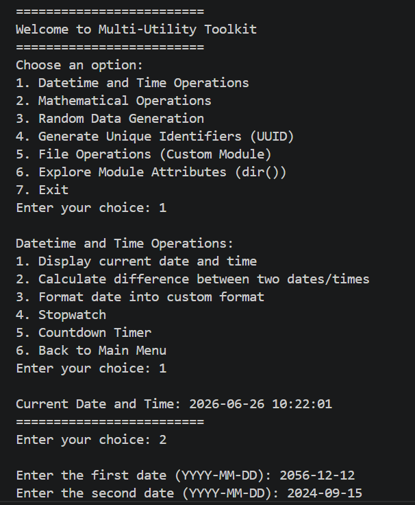
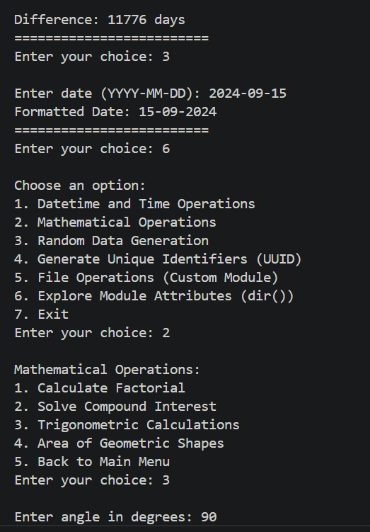
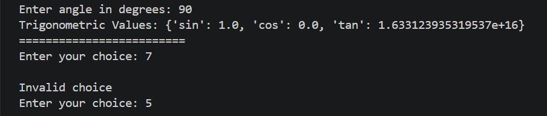
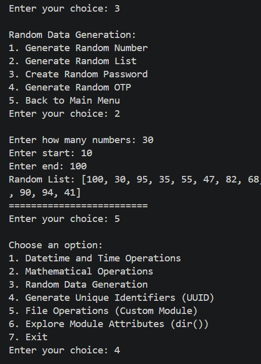
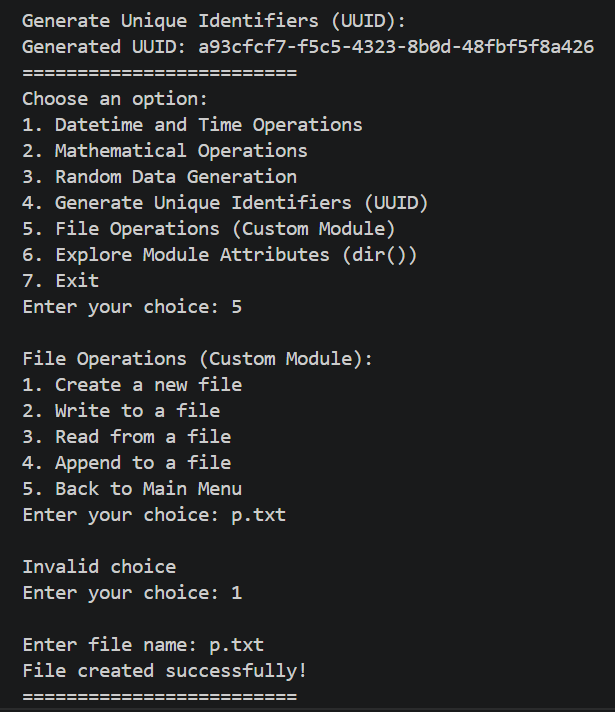
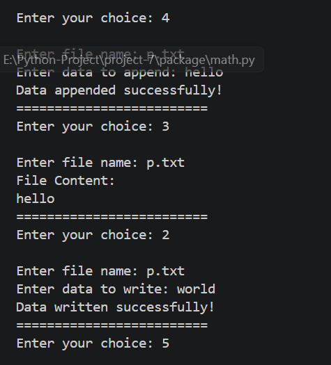
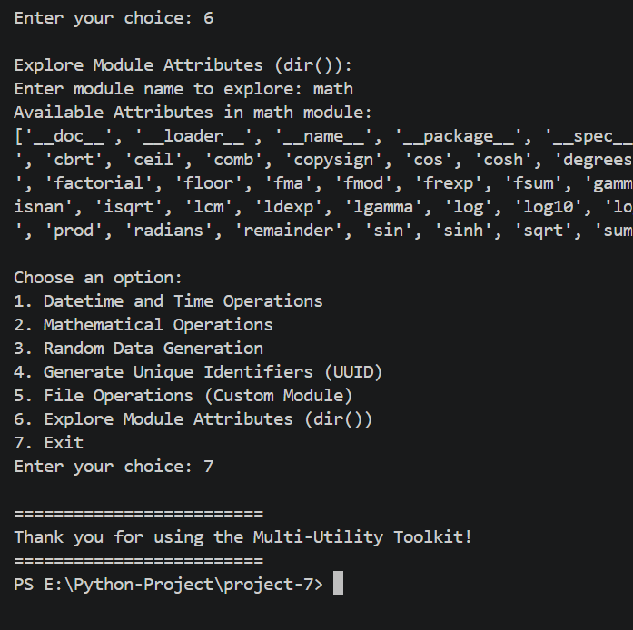

<div align="center">

# -- ! Multi-Utility Toolkit ! --
### *Interactive Console-Based Python Toolkit for Datetime, Math, Random Data, UUID & File Operations*

[](https://www.python.org/)
[](https://www.python.org/)
[](https://www.python.org/)
[](https://www.python.org/)

<br/>

> *"One toolkit, many utilities — datetime, math, randomness and files, all in a single menu."*

</div>

---

## 📋 Table of Contents

- [📌 Overview](#-overview)
- [🎯 Problem Statement](#-problem-statement)
- [✨ Key Features](#-key-features)
- [🏗️ Project Structure](#️-project-structure)
- [🔄 Project Workflow](#-project-workflow)
- [🕒 Part A — Datetime and Time Operations](#-part-a--datetime-and-time-operations)
- [🔢 Part B — Mathematical Operations](#-part-b--mathematical-operations)
- [🎲 Part C — Random Data Generation](#-part-c--random-data-generation)
- [🆔 Part D — UUID Generation](#-part-d--uuid-generation)
- [📂 Part E — File Operations (Custom Module)](#-part-e--file-operations-custom-module)
- [🔍 Part F — Explore Module Attributes](#-part-f--explore-module-attributes)
- [🖼️ Output Screenshots](#️-output-screenshots)
- [🛠️ Tech Stack](#️-tech-stack)
- [📈 Results & Insights](#-results--insights)
- [🏆 Advantages](#-advantages)
- [📄 License](#-license)
- [👤 Author](#-author)
- [🙏 Acknowledgements](#-acknowledgements)

---

## 📌 Overview

The **Multi-Utility Toolkit** is a menu-driven, interactive Python console application that bundles together several everyday programming utilities into a single program. It demonstrates **modular programming** (via a custom `package`), use of **built-in standard library modules** (`datetime`, `time`, `random`, `uuid`), and **dynamic module exploration** using `dir()`.

This project is designed to:
- Strengthen understanding of menu-driven program design using nested `while` and `if-elif-else` blocks
- Practice importing and using standard library modules (`datetime`, `time`, `random`, `uuid`)
- Build and use a custom local package (`package.file_operation`, `package.math`) for reusable logic
- Demonstrate dynamic introspection of any Python module using `dir()` and `__import__()`

---

## 🎯 Problem Statement

> **Objective:** Build a single console-based toolkit that brings together date/time utilities, math utilities, random data generation, UUID creation, file handling and module exploration — all from one main menu.

You are building an all-in-one utility program for everyday small tasks. The program must show a main menu, route the user to the correct sub-menu based on their choice, and keep looping back until the user explicitly chooses to exit.

| 📂 Feature | 📄 Type | 🔍 Description |
|------------|---------|----------------|
| Datetime & Time Ops | Standard Library | Current time, date difference, formatting, stopwatch, countdown |
| Mathematical Ops | Custom Module | Factorial, compound interest, trigonometry, area of shapes |
| Random Data Generation | Standard Library | Random numbers, lists, passwords, OTPs |
| UUID Generator | Standard Library | Generates a unique identifier (UUID4) |
| File Operations | Custom Module | Create, write, read and append to files |
| Module Explorer | Built-in | Lists all attributes of any importable module via `dir()` |

The goal is to demonstrate **modular, menu-driven Python programming** combining both standard library and custom package usage.

---

## ✨ Key Features

| Feature | Description |
|--------|-------------|
| 🔁 **Infinite Menu Loop** | Program runs continuously until user selects Exit |
| 🧩 **6 Sub-Menus** | Datetime, Math, Random, UUID, File Operations, Module Explorer |
| 📦 **Custom Package** | `package/file_operation.py` and `package/math.py` hold reusable logic |
| 🕒 **Time Utilities** | Current time, date difference, custom formatting, stopwatch, countdown timer |
| 🔢 **Math Utilities** | Factorial, compound interest, trigonometric values, area of shapes |
| 🎲 **Random Utilities** | Random number, random list, random password, random OTP |
| 🆔 **UUID Generator** | Instantly generates a UUID4 unique identifier |
| 📂 **File Handling** | Create, write, read, and append operations on text files |
| 🔍 **Module Introspection** | Explore any module's attributes dynamically using `dir()` |
| ⚠️ **Invalid Input Handling** | Detects and reports invalid menu choices gracefully |

---

## 🏗️ Project Structure

```
📦 project-7/
│
├── 📄 project-7.py            ← Main Python script (entry point)
│
├── 📁 package/                ← Custom local package
│   ├── 📄 __init__.py
│   ├── 📄 file_operation.py   ← File create/write/read/append logic
│   └── 📄 math.py             ← Factorial, interest, trig, area logic
│
├── 📁 screenshots/            ← Console output screenshots
│
└── 📄 README.md               ← Project documentation
```

---

## 🔄 Project Workflow

```
Program Start
      │
      ▼
┌─────────────────────────────┐
│      Display Main Menu      │  ← Options: 1 to 7
└────────────┬────────────────┘
             │
   ┌────┬────┼────┬────┬────┐
   ▼    ▼    ▼    ▼    ▼    ▼
 [1]  [2]  [3]  [4]  [5]  [6]
Date  Math Rand UUID File Explore
 │     │    │    │    │    │
 ▼     ▼    ▼    ▼    ▼    ▼
┌─────────────────────────────┐
│   Print Output to Console   │
└────────────┬────────────────┘
             │
             ▼
     Loop Back to Menu
             │
      (Choice: 7) Exit ✅
```

---

## 🕒 Part A — Datetime and Time Operations

> Handles all date and time related utilities using Python's built-in `datetime` and `time` modules.

**Sub-Menu:**
1. Display current date and time
2. Calculate difference between two dates
3. Format date into custom format
4. Stopwatch
5. Countdown Timer
6. Back to Main Menu

**Logic:**
```python
print("Current Date and Time:", datetime.now().strftime("%Y-%m-%d %H:%M:%S"))

a = datetime.strptime(d1, "%Y-%m-%d")
b = datetime.strptime(d2, "%Y-%m-%d")
diff = abs((b - a).days)
```

**Key Concepts Used:**

| Concept | Detail |
|---------|--------|
| 🕓 `datetime.now()` | Fetches the current system date and time |
| 📐 `strftime()` / `strptime()` | Formats and parses dates respectively |
| ⏱️ `time.time()` | Captures timestamps for the stopwatch |
| ⏳ `time.sleep()` | Creates the countdown timer delay |

---

## 🔢 Part B — Mathematical Operations

> Performs core mathematical calculations using a **custom module** — `package/math.py`.

**Sub-Menu:**
1. Calculate Factorial
2. Solve Compound Interest
3. Trigonometric Calculations
4. Area of Geometric Shapes
5. Back to Main Menu

**Logic:**
```python
print("Factorial:", factorial(n))
print("Compound Interest:", compound_interest(p, r, t))
print("Trigonometric Values:", trig_values(angle))
print("Area of Circle:", area_circle(r))
print("Area of Rectangle:", area_rectangle(l, w))
```

**Key Concepts Used:**

| Concept | Detail |
|---------|--------|
| 🧮 `factorial(n)` | Custom function imported from `package.math` |
| 💰 `compound_interest(p, r, t)` | Calculates compound interest from principal, rate, time |
| 📐 `trig_values(angle)` | Returns `sin`, `cos`, `tan` for a given angle |
| ⭕ `area_circle(r)` / `area_rectangle(l, w)` | Returns area for the chosen shape |

---

## 🎲 Part C — Random Data Generation

> Generates random numbers, lists, passwords and OTPs using Python's built-in `random` module.

**Sub-Menu:**
1. Generate Random Number
2. Generate Random List
3. Create Random Password
4. Generate Random OTP
5. Back to Main Menu

**Logic:**
```python
print("Random Number:", random.randint(s, e))

lst = []
for _ in range(count):
    lst.append(random.randint(s, e))

pwd = ""
for _ in range(length):
    pwd += random.choice(chars)

print("Generated OTP:", random.randint(100000, 999999))
```

**Key Concepts Used:**

| Concept | Detail |
|---------|--------|
| 🎲 `random.randint(s, e)` | Generates a random integer within a range |
| 🔁 Accumulator Pattern | Builds a list/password character by character |
| 🔐 `random.choice(chars)` | Picks a random character from a defined character set |

---

## 🆔 Part D — UUID Generation

> Generates a universally unique identifier (UUID4) using Python's built-in `uuid` module.

**Logic:**
```python
print("Generated UUID:", uuid.uuid4())
```

**Sample Output:**
```
Generated UUID: a93cfcf7-f5c5-4323-8b0d-48fbf5f8a426
```

---

## 📂 Part E — File Operations (Custom Module)

> Handles file creation, writing, reading and appending using a **custom module** — `package/file_operation.py`.

**Sub-Menu:**
1. Create a new file
2. Write to a file
3. Read from a file
4. Append to a file
5. Back to Main Menu

**Logic:**
```python
print(create_file(fname))
print(write_file(fname, data))
print(read_file(fname))
print(append_file(fname, data))
```

**Key Concepts Used:**

| Concept | Detail |
|---------|--------|
| 📄 `create_file(fname)` | Creates a new file with the given name |
| ✍️ `write_file(fname, data)` | Overwrites file content with new data |
| 📖 `read_file(fname)` | Reads and returns the file's content |
| ➕ `append_file(fname, data)` | Adds data to the end of an existing file |

---

## 🔍 Part F — Explore Module Attributes

> Dynamically explores any importable Python module's attributes using `__import__()` and `dir()`.

**Logic:**
```python
m = __import__(mname)
print("Available Attributes in", mname, "module:")
print(dir(m))
```

**Key Concepts Used:**

| Concept | Detail |
|---------|--------|
| 🔁 `__import__(mname)` | Imports a module dynamically by its name (as a string) |
| 🔍 `dir(m)` | Lists all attributes and functions available in that module |
| 🛡️ `try-except` | Catches errors if the entered module name doesn't exist |

---

## 🖼️ Output Screenshots

**1️⃣ Main Menu & Datetime Operations**


**2️⃣ Date Difference, Date Formatting & Math Menu**


**3️⃣ Trigonometric Calculations**


**4️⃣ Invalid Choice Handling**


**5️⃣ Random Data Generation**


**6️⃣ UUID Generation & File Operations**


**7️⃣ File Read/Write/Append Operations**


---

## 🛠️ Tech Stack

| Tool | Version | Purpose |
|------|---------|---------|
| 🐍 **Python** | 3.8+ | Core programming language |
| 🕒 **datetime** | Built-in | Date and time operations |
| ⏱️ **time** | Built-in | Stopwatch, countdown timer, delays |
| 🎲 **random** | Built-in | Random numbers, lists, passwords, OTPs |
| 🆔 **uuid** | Built-in | Unique identifier generation |
| 📦 **Custom Package** | Local | `package.file_operation` and `package.math` modules |
| 🔍 **dir() / __import__()** | Built-in | Dynamic module introspection |

---

## 📈 Results & Insights

After running the program, the following outputs are produced:

- ✅ **6 Functional Sub-Menus** — Datetime, Math, Random, UUID, File Operations, Module Explorer
- 🕒 **Accurate Date/Time Handling** — Date differences, formatting, stopwatch and countdown all work correctly
- 🔢 **Reliable Math Utilities** — Factorial, compound interest, trigonometry and area calculations via custom module
- 🎲 **Randomized Outputs** — Random numbers, lists, passwords and OTPs generated on demand
- 📂 **Working File I/O** — Files can be created, written, read and appended successfully
- 🔁 **Persistent Menu** — Program loops back after every task until manually exited
- ⚠️ **Error Feedback** — Invalid choices trigger a clear "Invalid choice" message

---

## 🏆 Advantages

| Advantage | Detail |
|-----------|--------|
| 🧩 **Modular Design** | Custom logic separated into a reusable `package` |
| 🎓 **Educational** | Combines standard library usage with custom package creation |
| 🔄 **Reusability** | `file_operation.py` and `math.py` functions can be reused in other projects |
| 🖥️ **No External Dependencies** | Uses only Python's built-in standard library |
| ⚡ **Lightweight** | Simple script + small custom package, runs instantly from any terminal |
| 🧪 **Extensible** | Easy to add new sub-menus (e.g., String Operations, JSON Tools) |
| 📖 **Readable Code** | Clear `if-elif-else` structure makes logic easy to follow |
| 🛡️ **Input Safety** | Invalid menu choices are caught and reported across every sub-menu |

---

## 📄 License

This project is licensed under the **MIT License** — see the [LICENSE](LICENSE) file for full details.

```
MIT License — Free to use, modify, and distribute with attribution.
```

---

## 👤 Author

<div align="center">

### Your Name Here

[](https://github.com/yourhandle)
[](https://www.linkedin.com/in/yourhandle/)

> *"A good toolkit isn't built in a day — it's built one utility at a time."*

**🎓 Role:** Junior Python Developer | Programming Enthusiast \
**📍 Location:** India\
**🛠️ Skills:** Python · Modular Programming · CLI Applications · Standard Library · Logic Building

</div>

---

## 🙏 Acknowledgements

Special thanks to the following resources and communities that made this project possible:

- 📚 [Python Official Docs](https://docs.python.org/3/) — Official Python language reference
- 🕒 [Python datetime Module Docs](https://docs.python.org/3/library/datetime.html) — Date and time handling reference
- 🎲 [Python random Module Docs](https://docs.python.org/3/library/random.html) — Random number generation reference
- 🆔 [Python uuid Module Docs](https://docs.python.org/3/library/uuid.html) — Unique identifier generation reference
- 🖥️ [W3Schools Python](https://www.w3schools.com/python/) — Beginner Python reference
- 💬 [Stack Overflow Community](https://stackoverflow.com/) — Problem-solving support
- 📖 [Kaggle Learn](https://www.kaggle.com/learn) — Python and programming courses

---

<div align="center">

---

*Made with ❤️ and ☕ — Last updated: 26 June, 2026*

</div>
