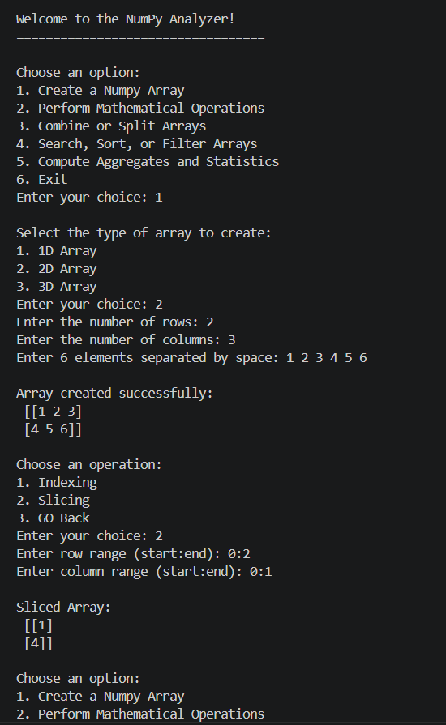
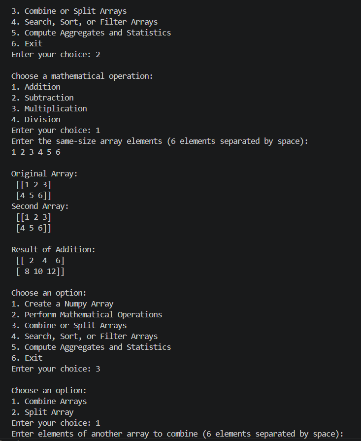
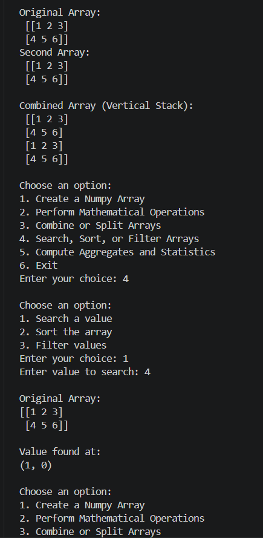
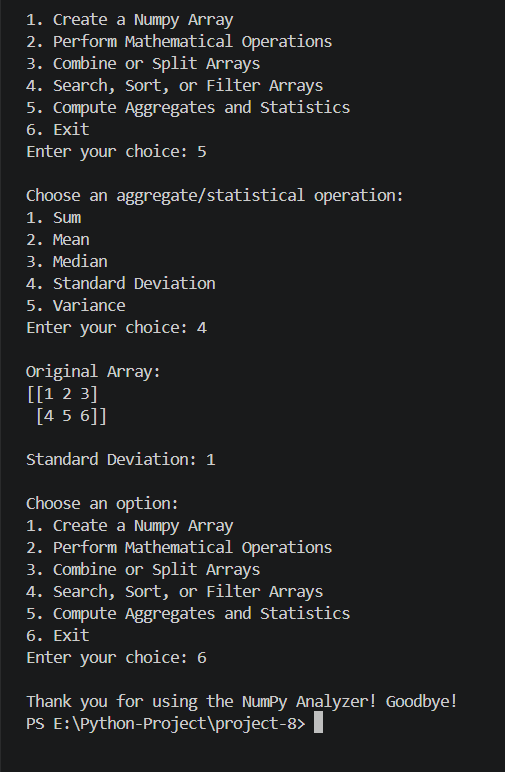

<div align="center">

# -- ! NumPy Array Analyzer ! --
### *Interactive Console-Based NumPy Array Creation & Analysis Tool*

[](https://www.python.org/)
[](https://numpy.org/)
[](https://www.python.org/)
[](https://www.python.org/)

<br/>

> *"Arrays are the language of data — NumPy just makes them fluent."*

</div>

---

## 📋 Table of Contents

- [📌 Overview](#-overview)
- [🎯 Problem Statement](#-problem-statement)
- [✨ Key Features](#-key-features)
- [🏗️ Project Structure](#️-project-structure)
- [🔄 Project Workflow](#-project-workflow)
- [🔢 Part A — Array Creation](#-part-a--array-creation)
- [➗ Part B — Mathematical Operations](#-part-b--mathematical-operations)
- [🔀 Part C — Combine & Split](#-part-c--combine--split)
- [🔍 Part D — Search, Sort & Filter](#-part-d--search-sort--filter)
- [📊 Part E — Aggregates & Statistics](#-part-e--aggregates--statistics)
- [🛠️ Tech Stack](#️-tech-stack)
- [🖼️ Sample Outputs](#️-sample-outputs)
- [🏆 Advantages](#-advantages)
- [📄 License](#-license)
- [👤 Author](#-author)
- [🙏 Acknowledgements](#-acknowledgements)

---

## 📌 Overview

The **NumPy Array Analyzer** is a beginner-friendly, interactive Python console application that demonstrates core **NumPy** concepts such as **array creation**, **indexing & slicing**, **element-wise operations**, **combining/splitting**, **searching/sorting/filtering**, and **statistical aggregation**. The program presents a menu-driven interface that runs continuously until the user chooses to exit.

This project is designed to:
- Strengthen understanding of NumPy array creation (1D, 2D, and 3D)
- Practice indexing, slicing, and reshaping of arrays
- Apply element-wise mathematical operations between arrays
- Perform searching, sorting, and conditional filtering on arrays
- Compute statistical aggregates such as sum, mean, median, standard deviation, and variance

---

## 🎯 Problem Statement

> **Objective:** Build a console-based interactive tool to create, manipulate, and analyze NumPy arrays.

You are building a utility program for students learning NumPy. The program must accept user choices from a menu and execute the corresponding task — creating arrays of different dimensions, performing arithmetic between arrays, combining or splitting arrays, searching/sorting/filtering values, or computing statistical measures.

| 📂 Feature | 📄 Type | 🔍 Description |
|------------|---------|----------------|
| Array Creation | Console Input | Creates 1D, 2D, or 3D NumPy arrays from user input |
| Mathematical Operations | Logic | Element-wise Addition, Subtraction, Multiplication, Division |
| Combine / Split | Logic | Vertically stacks or splits arrays into sections |
| Search / Sort / Filter | Logic | Locates values, sorts arrays, filters by condition |
| Aggregates & Statistics | Logic | Computes Sum, Mean, Median, Std Deviation, Variance |

The goal is to demonstrate **practical NumPy programming skills** through a clean, menu-driven interactive program.

---

## ✨ Key Features

| Feature | Description |
|--------|-------------|
| 🔁 **Infinite Menu Loop** | Program runs continuously until user selects Exit |
| 🔢 **Multi-Dimensional Arrays** | Supports creation of 1D, 2D, and 3D arrays |
| 📐 **Indexing & Slicing** | Custom slice parser supports `start:end` notation per axis |
| ➕ **Element-wise Math** | Addition, Subtraction, Multiplication, and safe Division |
| 🔀 **Combine & Split** | Vertical stacking and array splitting into equal sections |
| 🔍 **Search Values** | Locates positions of a value within the array |
| ⬆️ **Sort Arrays** | Row-wise sorting using `np.sort` |
| 🧮 **Filter by Condition** | Filters elements using `>`, `<`, `>=`, `<=`, `==` operators |
| 📊 **Statistics Suite** | Sum, Mean, Median, Standard Deviation, and Variance |
| 🖥️ **CLI Interface** | Simple, clean text-based menu for user interaction |
| ✅ **Input-Driven Flow** | Fully driven by user input with branching via `match-case` |
| ⚠️ **Error Handling** | Try/except blocks catch invalid input and shape mismatches |

---

## 🏗️ Project Structure

```
📦 project-8/
│
├── 📄 numpy_anaylizer.py    ← Main Python script (entry point)
│
├── 🖼️ output-1.png          ← Sample output — Statistics menu
├── 🖼️ output-2.png          ← Sample output — Array creation & slicing
├── 🖼️ output-3.png          ← Sample output — Mathematical operations
├── 🖼️ output-4.png          ← Sample output — Combine & Search
│
└── 📄 README.md             ← Project documentation
```

---

## 🔄 Project Workflow

```
Program Start
      │
      ▼
┌─────────────────────────────┐
│   Display Main Menu         │  ← Options: 1-6
└────────────┬────────────────┘
             │
   ┌─────────┼─────────┬─────────────┬──────────────┐
   ▼         ▼         ▼             ▼              ▼
┌────────┐ ┌────────┐ ┌───────────┐ ┌────────────┐ ┌────────┐
│Choice:1│ │Choice:2│ │ Choice: 3 │ │ Choice: 4  │ │Choice:5│
│(Create)│ │ (Math) │ │(Combine/  │ │(Search/    │ │(Stats) │
│        │ │        │ │  Split)   │ │Sort/Filter)│ │        │
└───┬────┘ └───┬────┘ └─────┬─────┘ └─────┬──────┘ └───┬────┘
    │          │            │             │            │
    ▼          ▼            ▼             ▼            ▼
┌─────────────────────────────────────────────────────────┐
│              Print Result to Console                     │
└────────────────────────┬──────────────────────────────────┘
                          │
                          ▼
                  Loop Back to Menu
                          │
                  (Choice: 6) Exit ✅
```

---

## 🔢 Part A — Array Creation

### 📝 1. What is Array Creation?

The program supports creating **1D, 2D, and 3D** NumPy arrays directly from space-separated user input, which is then reshaped into the required dimensions.

---

### 🗺️ 2. Creation Types — Overview

| Type | Shape | Logic Used |
|------|-------|------------|
| 1️⃣ | **1D Array** | `np.fromstring(elems, sep=" ").reshape((size,))` |
| 2️⃣ | **2D Array** | Reshaped into `(rows, cols)` |
| 3️⃣ | **3D Array** | Reshaped into `(depth, rows, cols)` |

**Logic:**
```python
elems = input(f"Enter {rows * cols} elements separated by space: ")
analyzer.array = np.fromstring(elems, sep=" ", dtype=int).reshape((rows, cols))
```

---

### 📐 3. Indexing & Slicing

> After creation, the user can index a single element or slice a range using `start:end` notation for each dimension.

**Logic:**
```python
@staticmethod
def parse_slice(slice_str):
    if not slice_str or ":" not in slice_str:
        return slice(None)
    parts = slice_str.split(":")
    start = int(parts[0]) if parts[0] else None
    end = int(parts[1]) if parts[1] else None
    return slice(start, end)
```

---

## ➗ Part B — Mathematical Operations

> Performs element-wise arithmetic between the created array and a second, same-shaped array.

**Logic:**
```python
def elementwise_add(self, other_arr):
    self._check_shape(other_arr)
    return np.add(self.__array, other_arr)

def elementwise_divide(self, other_arr):
    self._check_shape(other_arr)
    res = np.divide(self.__array, other_arr,
                     out=np.zeros_like(self.__array, dtype=float),
                     where=other_arr != 0)
    return res.astype(int)
```

**Key Concepts Used:**

| Concept | Detail |
|---------|--------|
| ➕ Element-wise Addition | `np.add(arr1, arr2)` |
| ➖ Element-wise Subtraction | `np.subtract(arr1, arr2)` |
| ✖️ Element-wise Multiplication | `np.multiply(arr1, arr2)` |
| ➗ Safe Division | `np.divide` with `where=other_arr != 0` to avoid divide-by-zero |
| 🛡️ Shape Validation | `_check_shape()` ensures identical dimensions before any operation |

---

## 🔀 Part C — Combine & Split

> Combines two same-shaped arrays vertically, or splits a single array into equal sections.

**Logic:**
```python
def combine_vertical(self, other_arr):
    return np.vstack((self.__array, other_arr))

def split_array(self, sections):
    return np.array_split(self.__array, sections)
```

---

## 🔍 Part D — Search, Sort & Filter

> Locates a value's position, sorts the array row-wise, or filters elements by a comparison condition.

**Logic:**
```python
def search_value(self, value):
    return np.where(self.__array == value)

def sort_array(self):
    return np.sort(self.__array, axis=-1)

def filter_condition(self, operator, threshold):
    match operator:
        case ">":
            mask = self.__array > threshold
        case "<":
            mask = self.__array < threshold
        case "==":
            mask = self.__array == threshold
        case ">=":
            mask = self.__array >= threshold
        case "<=":
            mask = self.__array <= threshold
        case _:
            mask = np.ones_like(self.__array, dtype=bool)
    return self.__array[mask]
```

---

## 📊 Part E — Aggregates & Statistics

> Computes core statistical measures over the entire array.

**Logic:**
```python
def compute_sum(self):
    return int(np.sum(self.__array))

def compute_mean(self):
    return int(np.mean(self.__array))

def compute_median(self):
    return float(np.median(self.__array))

def compute_std(self):
    return int(np.std(self.__array))

def compute_variance(self):
    return int(np.var(self.__array))
```

**Key Concepts Used:**

| Concept | Detail |
|---------|--------|
| ➕ `np.sum()` | Total of all elements |
| 📊 `np.mean()` | Average value |
| 🎯 `np.median()` | Middle value of sorted data |
| 📉 `np.std()` | Standard deviation (spread of data) |
| 📐 `np.var()` | Variance (squared spread of data) |

**Sample Output:**
```
Original Array:
[[1 2 3]
 [4 5 6]]

Standard Deviation: 1
```

---

## 🛠️ Tech Stack

| Tool | Version | Purpose |
|------|---------|---------|
| 🐍 **Python** | 3.8+ | Core programming language |
| 🔢 **NumPy** | Latest | Array creation, reshaping, and mathematical operations |
| 🔁 **While Loop** | Built-in | Infinite menu loop control |
| 🔂 **match-case** | Python 3.10+ | Menu branching and operation selection |
| 🧮 **Arithmetic Operators** | Built-in | Element-wise math and comparisons |
| 🖨️ **print() / input()** | Built-in | Console I/O and user interaction |
| 📐 **f-strings** | Python 3.6+ | Formatted string output |

---

## 🖼️ Sample Outputs

Below are sample console runs demonstrating the program in action:

| Screenshot | Description |
|------------|--------------|
|  | Computing Standard Deviation via the Statistics menu |
|  | Creating a 2D array and slicing it |
|  | Performing element-wise Addition on two arrays |
|  | Combining arrays vertically and searching for a value |

---

## 🏆 Advantages

| Advantage | Detail |
|-----------|--------|
| 🎓 **Beginner Friendly** | Core NumPy concepts covered in one project |
| 🔄 **Reusability** | `DataAnalytics` class methods can be reused in other projects |
| 📚 **Educational** | Each option reinforces a different NumPy capability |
| 🖥️ **Minimal Dependencies** | Runs with just Python + NumPy |
| ⚡ **Lightweight** | Single-file script, instantly runnable from any terminal |
| 🧪 **Extensible** | Easy to add new operations (e.g., matrix multiplication, transpose) |
| 📖 **Readable Code** | Clear `match-case` structure makes logic easy to follow |
| 🛡️ **Input Safety** | Shape mismatches and invalid choices are caught and reported |

---

## 📄 License

This project is licensed under the **MIT License** — see the [LICENSE](LICENSE) file for full details.

```
MIT License — Free to use, modify, and distribute with attribution.
```

---

## 👤 Author

<div align="center">

### Priya Shihora


> *"Every dataset starts with a single array — just like every program starts with a single line."*

**🎓 Role:** Junior Python Developer | Programming Enthusiast \
**📍 Location:** India\
**🛠️ Skills:** Python · NumPy · CLI Applications · Logic Building · Data Analysis

</div>

---

## 🙏 Acknowledgements

Special thanks to the following resources and communities that made this project possible:

- 📚 [Python Official Docs](https://docs.python.org/3/) — Official Python language reference
- 🔢 [NumPy Official Docs](https://numpy.org/doc/stable/) — NumPy reference and user guide
- 📐 [Real Python — NumPy](https://realpython.com/numpy-array-programming/) — In-depth NumPy tutorials
- 🖥️ [W3Schools NumPy](https://www.w3schools.com/python/numpy/default.asp) — Beginner NumPy reference
- 🧮 [Python f-strings Guide](https://realpython.com/python-f-strings/) — Formatted string literals
- 💬 [Stack Overflow Community](https://stackoverflow.com/) — Problem-solving support
- 📖 [Kaggle Learn](https://www.kaggle.com/learn) — Python and programming courses

---

<div align="center">

---

*Made with ❤️ and ☕ — Last updated: 13 July, 2026*

</div>
