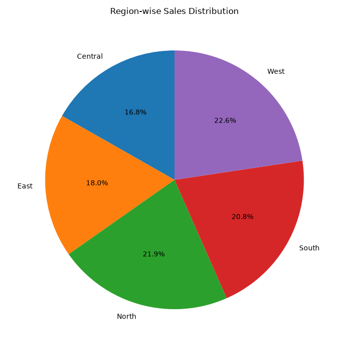

<div align="center">

# -- ! Sales Data Analyzer ! --
### *Interactive Console-Based Sales Data Analysis & Visualization Tool*

[](https://www.python.org/)
[](https://pandas.pydata.org/)
[](https://numpy.org/)
[](https://matplotlib.org/)
[](https://seaborn.pydata.org/)

<br/>

> *"Data tells a story — visualization just gives it a voice."*

</div>

---

## 📋 Table of Contents

- [📌 Overview](#-overview)
- [🎯 Problem Statement](#-problem-statement)
- [✨ Key Features](#-key-features)
- [🏗️ Project Structure](#️-project-structure)
- [🔄 Project Workflow](#-project-workflow)
- [🔢 Part A — Load & Explore Data](#-part-a--load--explore-data)
- [➗ Part B — DataFrame Operations](#-part-b--dataframe-operations)
- [🧹 Part C — Handle Missing Data](#-part-c--handle-missing-data)
- [📊 Part D — Descriptive Statistics](#-part-d--descriptive-statistics)
- [📈 Part E — Data Visualization](#-part-e--data-visualization)
- [🛠️ Tech Stack](#️-tech-stack)
- [🖼️ Sample Outputs](#️-sample-outputs)
- [🏆 Advantages](#-advantages)
- [📄 License](#-license)
- [👤 Author](#-author)
- [🙏 Acknowledgements](#-acknowledgements)

---

## 📌 Overview

The **Sales Data Analyzer** is a beginner-friendly, interactive Python console application that demonstrates core **Pandas**, **NumPy**, and **data visualization** concepts such as **loading & exploring datasets**, **DataFrame operations**, **handling missing data**, **descriptive statistics**, and **charting**. The program presents a menu-driven interface that runs continuously until the user chooses to exit.

This project is designed to:
- Strengthen understanding of loading and exploring real-world CSV datasets with Pandas
- Practice NumPy array extraction and element-wise mathematical operations on DataFrame columns
- Combine and split datasets based on conditions
- Search, sort, and filter sales records
- Detect and handle missing values in a dataset
- Compute descriptive statistics and build pivot tables
- Visualize sales data using multiple chart types (bar, line, scatter, pie, histogram, stack plot, subplots, heatmap, box plot)

---

## 🎯 Problem Statement

> **Objective:** Build a console-based interactive tool to load, clean, analyze, and visualize sales data.

You are building a utility program for analysts working with sales records. The program must accept user choices from a menu and execute the corresponding task — loading and exploring a CSV dataset, performing DataFrame/NumPy operations, cleaning missing values, generating descriptive statistics, or plotting different types of visualizations.

| 📂 Feature | 📄 Type | 🔍 Description |
|------------|---------|----------------|
| Load & Explore Data | Console Input | Loads a CSV file into a Pandas DataFrame and inspects it |
| DataFrame Operations | Logic | NumPy array extraction, arithmetic, combine, split, search/sort/filter |
| Handle Missing Data | Logic | Detects, fills, drops, or replaces missing values |
| Descriptive Statistics | Logic | Aggregate functions, statistical analysis, pivot tables |
| Data Visualization | Logic | Bar, Line, Scatter, Pie, Histogram, Stack Plot, Subplots, Heatmap, Box Plot |
| Save Visualization | I/O | Saves the last generated chart as PNG or JPEG |

The goal is to demonstrate **practical Pandas, NumPy, and Matplotlib/Seaborn programming skills** through a clean, menu-driven interactive program.

---

## ✨ Key Features

| Feature | Description |
|--------|-------------|
| 🔁 **Infinite Menu Loop** | Program runs continuously until user selects Exit |
| 📂 **CSV Loading with Error Handling** | Handles missing files, empty files, parser errors, and permission errors |
| 🔍 **Data Exploration** | View head, tail, column names, data types, and dataset info |
| 🔢 **NumPy Array Operations** | Converts DataFrame columns (Quantity, Sales, Revenue, Profit) into NumPy arrays |
| ➕ **Element-wise Math** | Addition, Subtraction, Multiplication, and Division across columns |
| 🔀 **Combine & Split** | Merges two sales datasets, or splits data by Region / Product |
| 🧮 **Search / Sort / Filter** | Search by Product or Sales value, sort by Sales/Profit, filter by Region/Year |
| 🧹 **Missing Data Handling** | Display, fill with mean, drop rows, or replace with a custom value |
| 📊 **Descriptive Statistics** | Sum, Mean, Count, Std Deviation, Variance, Percentiles, Pivot Tables |
| 📈 **9 Chart Types** | Bar, Line, Scatter, Pie, Histogram, Stack Plot, Subplots grid, Heatmap, Box Plot |
| 💾 **Save Visualization** | Exports the last plotted chart as `.png` or `.jpg` |
| 🖥️ **CLI Interface** | Simple, clean text-based menu for user interaction |
| ✅ **Input-Driven Flow** | Fully driven by user input with branching via `match-case` |
| ⚠️ **Error Handling** | Try/except blocks catch invalid input, missing files, and bad column names |

---

## 🏗️ Project Structure

```
📦 project-9/
│
├── 📄 project-9.ipynb        ← Main Jupyter Notebook (entry point)
│
├── 📊 sales_data.csv         ← Primary sales dataset (500 records)
├── 📊 sales_data2.csv        ← Secondary sales dataset for combine/split (100 records)
│
├── 🖼️ pie_chart.png          ← Sample output — Region-wise Sales Distribution
│
└── 📄 README.md              ← Project documentation
```

---

## 🔄 Project Workflow

```
Program Start
      │
      ▼
┌─────────────────────────────┐
│   Display Main Menu         │  ← Options: 1-8
└────────────┬────────────────┘
             │
   ┌─────────┼─────────┬─────────────┬──────────────┬──────────────┐
   ▼         ▼         ▼             ▼              ▼              ▼
┌────────┐ ┌────────┐ ┌───────────┐ ┌────────────┐ ┌────────┐ ┌──────────┐
│Choice:1│ │Choice:2│ │ Choice: 3 │ │ Choice: 4  │ │Choice:5│ │Choice:6/7│
│(Load)  │ │(Explore│ │(DataFrame │ │(Handle     │ │(Stats) │ │(Visualize│
│        │ │  Data) │ │Operations)│ │Missing Data│ │        │ │ / Save)  │
└───┬────┘ └───┬────┘ └─────┬─────┘ └─────┬──────┘ └───┬────┘ └────┬─────┘
    │          │            │             │            │           │
    ▼          ▼            ▼             ▼            ▼           ▼
┌──────────────────────────────────────────────────────────────────────┐
│                     Print Result / Show Chart                        │
└────────────────────────────────┬───────────────────────────────────────┘
                                  │
                                  ▼
                          Loop Back to Menu
                                  │
                          (Choice: 8) Exit ✅
```

---

## 🔢 Part A — Load & Explore Data

### 📝 1. Loading the Dataset

The program loads a CSV file into a Pandas DataFrame and automatically parses the `Date` column into a proper datetime type, with error handling for missing, empty, invalid, or permission-restricted files.

**Logic:**
```python
def load_data(self):
    path = input("Enter CSV file path: ")
    try:
        self.df = pd.read_csv(path)
        self.df["Date"] = pd.to_datetime(self.df["Date"], format="%Y-%m-%d")
        print(f"Rows: {self.df.shape[0]}")
        print(f"Columns: {self.df.shape[1]}")
    except FileNotFoundError:
        print("Error: File not found.")
    except pd.errors.EmptyDataError:
        print("Error: File is empty.")
    except pd.errors.ParserError:
        print("Error: Invalid CSV file.")
```

---

### 🗺️ 2. Exploring the Dataset

| Option | Action |
|--------|--------|
| 1️⃣ | Display First 5 Rows (`df.head()`) |
| 2️⃣ | Display Last 5 Rows (`df.tail()`) |
| 3️⃣ | Display Column Names (`df.columns`) |
| 4️⃣ | Display Data Types (`df.dtypes`) |
| 5️⃣ | Display Basic Information (`df.info()`) |

**Dataset Snapshot:**

| Column | Description |
|--------|-------------|
| `SalesID` | Unique transaction identifier |
| `Date` | Date of sale |
| `Year` | Year of sale |
| `Product` | Product name (e.g., Laptop, Monitor, Printer) |
| `Region` | Sales region (South, North, Central, West, East) |
| `CustomerID` | Unique customer identifier |
| `Quantity` | Units sold |
| `Sales` | Sales amount |
| `Revenue` | Revenue generated |
| `Profit` | Profit earned |

---

## ➗ Part B — DataFrame Operations

> Performs NumPy array extraction, element-wise arithmetic, combining/splitting datasets, and search/sort/filter operations on the sales data.

### 🔹 NumPy Array Operations

**Logic:**
```python
def numpy_array_operations(self):
    arr = self.df["Sales"].to_numpy()
    print(arr[:10], "...")
    print("First Element:", arr[0])
    print("First Five Elements:", arr[:5])
```

### 🔹 Mathematical Operations

**Logic:**
```python
result = self.df["Sales"] + self.df["Profit"]      # Addition
result = self.df["Revenue"] - self.df["Sales"]      # Subtraction
result = self.df["Quantity"] * self.df["Sales"]     # Multiplication
result = self.df["Revenue"] / self.df["Quantity"]   # Division
```

### 🔹 Combine & Split

**Logic:**
```python
def combine_dataframes(self):
    path = input("Enter second CSV file path: ")
    df2 = pd.read_csv(path)
    combined_df = pd.concat([self.df, df2], ignore_index=True)

def split_dataframe(self):
    split_df = self.df[self.df["Region"] == region]   # or by Product
```

### 🔹 Search / Sort / Filter

| Option | Action |
|--------|--------|
| Search Product | Case-insensitive match on `Product` column |
| Search Sales | Exact match on `Sales` value |
| Sort by Sales | `df.sort_values(by="Sales", ascending=False)` |
| Sort by Profit | `df.sort_values(by="Profit", ascending=False)` |
| Filter by Region | Case-insensitive match on `Region` column |
| Filter by Year | Exact match on `Year` column |

---

## 🧹 Part C — Handle Missing Data

> Detects and resolves missing values across the dataset (both `sales_data.csv` and `sales_data2.csv` contain a few missing entries in `Product`, `Region`, `Quantity`, `Sales`, `Revenue`, and `Profit`).

**Logic:**
```python
def clean_data(self):
    match choice:
        case "1":
            missing_rows = self.df[self.df.isnull().any(axis=1)]
        case "2":
            numeric_columns = self.df.select_dtypes(include="number").columns
            self.df[numeric_columns] = self.df[numeric_columns].fillna(
                self.df[numeric_columns].mean()
            )
        case "3":
            self.df.dropna(inplace=True)
        case "4":
            value = input("Enter value to replace missing values: ")
            self.df.fillna(value, inplace=True)
```

| Option | Action |
|--------|--------|
| 1️⃣ | Display rows with missing values |
| 2️⃣ | Fill missing numeric values with column mean |
| 3️⃣ | Drop rows with missing values |
| 4️⃣ | Replace missing values with a custom value |

---

## 📊 Part D — Descriptive Statistics

> Computes core statistical measures and pivot tables over the sales data.

**Logic:**
```python
def aggregate_functions(self):
    print(self.df[["Quantity","Sales","Revenue","Profit"]].sum())
    print(self.df[["Quantity","Sales","Revenue","Profit"]].mean())
    print(self.df[["Quantity","Sales","Revenue","Profit"]].count())

def statistical_analysis(self):
    print(self.df.describe())
    print(self.df[["Quantity","Sales","Revenue","Profit"]].std())
    print(self.df[["Quantity","Sales","Revenue","Profit"]].var())
    print(self.df[["Quantity","Sales","Revenue","Profit"]].quantile([0.25, 0.50, 0.75]))

def create_pivot_table(self):
    pivot = self.df.pivot_table(values="Sales", index="Region", aggfunc="sum")
    # or values="Profit", index="Product"
```

**Key Concepts Used:**

| Concept | Detail |
|---------|--------|
| ➕ `sum()` / `mean()` / `count()` | Aggregate functions on numeric columns |
| 📉 `std()` / `var()` | Spread and variance of Quantity, Sales, Revenue, Profit |
| 🎯 `quantile()` | 25th, 50th, and 75th percentiles |
| 🗂️ `pivot_table()` | Region-wise Sales and Product-wise Profit summaries |

---

## 📈 Part E — Data Visualization

> Generates 9 different chart types using Matplotlib and Seaborn, with an option to save the last generated chart.

| Chart Type | Function | Description |
|------------|----------|--------------|
| 📊 Bar Chart | `bar_chart()` | Region-wise total Sales |
| 📈 Line Chart | `line_chart()` | Year-wise total Sales trend |
| ⚫ Scatter Plot | `scatter_plot()` | Sales vs Profit relationship |
| 🥧 Pie Chart | `pie_chart()` | Region-wise Sales distribution |
| 📶 Histogram | `histogram()` | Frequency distribution of Sales |
| 🌊 Stack Plot | `stack_plot()` | Monthly Sales, Revenue & Profit stacked |
| 🔲 Subplots | `subplots_chart()` | 2×2 grid combining Bar, Line, Histogram & Scatter |
| 🔥 Heatmap | `heatmap()` | Correlation heatmap of numeric columns |
| 📦 Box Plot | `box_plot()` | Distribution of a chosen column across categories |

**Sample Logic — Pie Chart:**
```python
def pie_chart(self):
    sales = self.df.groupby("Region")["Sales"].sum()
    plt.pie(sales, labels=sales.index, autopct="%1.1f%%", startangle=90)
    plt.title("Region-wise Sales Distribution")
    plt.show()
```

### 💾 Save Visualization

After generating any chart, the current figure can be exported as PNG or JPEG:

```python
def save_visualization(self):
    file_name = input("Enter file name (without extension): ")
    self.current_figure.savefig(file_name + ".png")   # or .jpg
```

---

## 🛠️ Tech Stack

| Tool | Version | Purpose |
|------|---------|---------|
| 🐍 **Python** | 3.10+ | Core programming language |
| 🐼 **Pandas** | Latest | Data loading, cleaning, and DataFrame operations |
| 🔢 **NumPy** | Latest | Array extraction and element-wise operations |
| 📈 **Matplotlib** | Latest | Bar, Line, Scatter, Pie, Stack Plot, Subplots, Save |
| 🎨 **Seaborn** | Latest | Histogram, Heatmap, Box Plot |
| 🔁 **While Loop** | Built-in | Infinite menu loop control |
| 🔂 **match-case** | Python 3.10+ | Menu branching and operation selection |
| 🖨️ **print() / input()** | Built-in | Console I/O and user interaction |

---

## 🖼️ Sample Outputs

Below is a sample chart generated by the program:

| Screenshot | Description |
|------------|--------------|
|  | Region-wise Sales Distribution — generated using `pie_chart()` |

---

## 🏆 Advantages

| Advantage | Detail |
|-----------|--------|
| 🎓 **Beginner Friendly** | Core Pandas, NumPy, and visualization concepts covered in one project |
| 🔄 **Reusability** | `SalesDataAnalyzer` class methods can be reused in other data projects |
| 📚 **Educational** | Each option reinforces a different data analysis capability |
| 🖥️ **Minimal Dependencies** | Runs with just Python + Pandas + NumPy + Matplotlib + Seaborn |
| ⚡ **End-to-End Workflow** | Covers loading → cleaning → analyzing → visualizing → saving |
| 🧪 **Extensible** | Easy to add new chart types or statistical measures |
| 📖 **Readable Code** | Clear `match-case` structure makes logic easy to follow |
| 🛡️ **Input Safety** | File errors, missing columns, and invalid choices are caught and reported |

---

## 📄 License

This project is licensed under the **MIT License** — see the [LICENSE](LICENSE) file for full details.

```
MIT License — Free to use, modify, and distribute with attribution.
```

---

## 👤 Author

<div align="center">

### Priya Shihora

> *"Behind every clean chart is a messy dataset that got cleaned first."*

**🎓 Role:** Junior Python Developer | Programming Enthusiast \
**📍 Location:** India\
**🛠️ Skills:** Python · Pandas · NumPy · Matplotlib · Seaborn · Data Analysis · CLI Applications

</div>

---

## 🙏 Acknowledgements

Special thanks to the following resources and communities that made this project possible:

- 📚 [Python Official Docs](https://docs.python.org/3/) — Official Python language reference
- 🐼 [Pandas Official Docs](https://pandas.pydata.org/docs/) — Pandas reference and user guide
- 🔢 [NumPy Official Docs](https://numpy.org/doc/stable/) — NumPy reference and user guide
- 📈 [Matplotlib Official Docs](https://matplotlib.org/stable/index.html) — Plotting reference
- 🎨 [Seaborn Official Docs](https://seaborn.pydata.org/) — Statistical visualization reference
- 🖥️ [W3Schools Pandas](https://www.w3schools.com/python/pandas/default.asp) — Beginner Pandas reference
- 💬 [Stack Overflow Community](https://stackoverflow.com/) — Problem-solving support
- 📖 [Kaggle Learn](https://www.kaggle.com/learn) — Python and data analysis courses

---

<div align="center">

---

*Made with ❤️ and ☕ — Last updated: 15 July, 2026*

</div>
